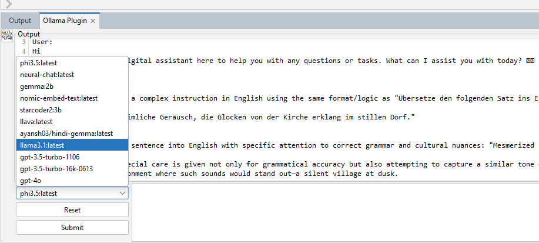
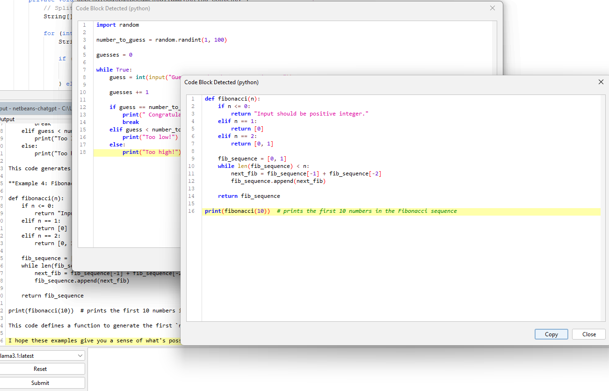
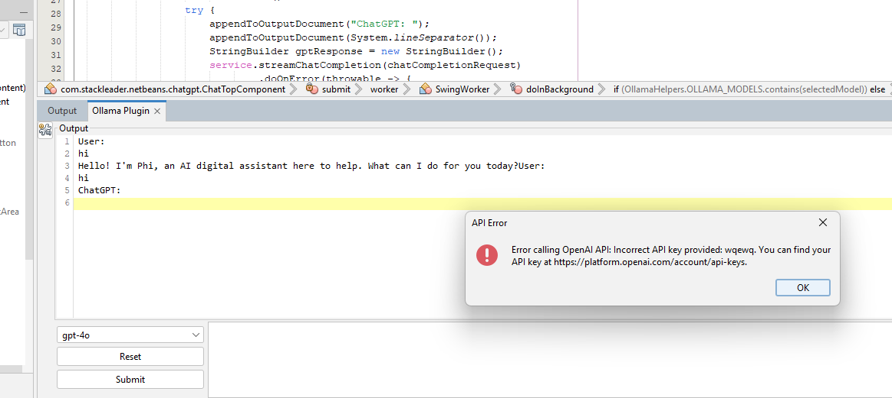

# NetBeans Ollama Plugin

Credits to orginal Plugin [https://github.com/Hillrunner2008/netbeans-chatgpt](https://github.com/Hillrunner2008/netbeans-chatgpt)

This plugin allows you to use Ollama and OpenAI APIs to generate chat responses directly in NetBeans. I'll probably add some editor context menu actions to speed up code suggestions, but for now its a simple UI for chat that lives in Netbeans.

### Code block detection

### Search Chat History (RAG)
Search is added for the chat history. This can search all the history of chats and give back the response and code based on what is put into the input text area.  Please ensure Ollama has this model -> "nomic-embed-text:latest".

### Vision OCR options is included
Model used: llama3.2-vision

Incase you key is incorrect for OpenAI, you get this error. This integration is not well tested fot OpenAI Keys, if anyone can test and let me know it works, I will update this section.

A task is added, when clicked, it will detect possible bugs and other issues in code.

It can also appreciate the good work :)

## Installation

1. Clone the code, bulild it, then,
2. In NetBeans, go to `Tools > Plugins`.
3. Click on the `Downloaded` tab.
4. Click on the `Add Plugins...` button and select the compiled plugin.
5. Restart NetBeans

## Customizations
In OS environment variable if "LLM_OLLAMA_HOST" is present, then this will override the url "http://localhost:11434" that points to local Ollama endpoint.

This is what is happening inside plugin code:

static String OLLAMA_EP="http://localhost:11434";
 
static{
        //LLM Settings        
        String value_name = System.getenv("LLM_OLLAMA_HOST");//Get this from environment vaiable to add flexibility to refer to any other Ollama hosting.
        if(value_name!=null) OLLAMA_EP=value_name;
    }
