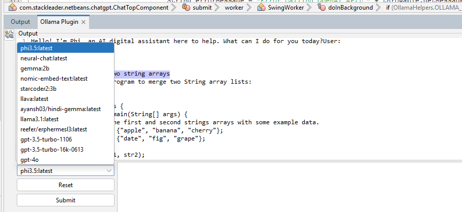

# NetBeans Ollama Plugin

Credits to orginal Plugin [https://github.com/Hillrunner2008/netbeans-chatgpt](https://github.com/Hillrunner2008/netbeans-chatgpt)

This plugin allows you to use Ollama and OpenAI APIs to generate chat responses directly in NetBeans. I'll probably add some editor context menu actions to speed up code suggestions, but for now its a simple UI for chat that lives in Netbeans.

Incase you key is incorrect for OpenAI, you get this error. This integration is not well tested fot OpenAI Keys, if anyone can test and let me know it works, I will update this section.

## Installation

1. Clone the code, bulild it, then,
2. In NetBeans, go to `Tools > Plugins`.
3. Click on the `Downloaded` tab.
4. Click on the `Add Plugins...` button and select the compiled plugin.
5. Restart NetBeans
